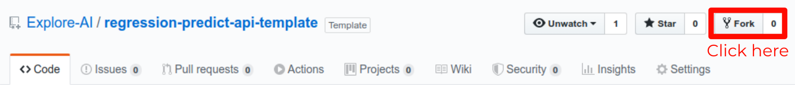

# Flask-based Model API
#### EXPLORE Data Science Academy Regression Predict

## 1) Overview

This repository forms the basis of *Task 2* for the **Regression Predict** within EDSA's Data Science course. It hosts template code which will enable students to deploy their own developed models through a web server-based API.   

#### 1.1) Wait, what is an API again?

[](https://youtu.be/s7wmiS2mSXY)

An API - or Application Programming Interface - refers to a set of procedures and protocols that allows us to send and request information between ourselves and remote applications. You can think of this as a channel of communication to a remote server using specific commands that allow you to use their applications without needing to host that functionality yourself. Many types of API's exist, but for this predict task we are interested specifically in Web API's. These allow us to send and receive information using web development languages, such as HTML and JSON. The video above provides a simple and intuitive explanation of how API's operate.

#### 1.2) How our API will work


##### Description of files

Several files within this repository enable the correct functioning of our API. We provide a high-level description of these salient files within the table below:

| File Name              | Description                                                                          |
| :--------------------- | :--------------------                                                                |
| `api.py`               | Flask web server application definition and instantiation.                           |
| `model.py`             | Contains helper functions to separate model specific code from our API definition.   |
| `utils/request.py`     | Simple script to simulate a POST request sent to our API.                            |
| `utils/train_model.py` | Code used to train the simple model used for demonstration of the API's functioning. |

## 2) Usage Instructions

#### 2.1) Creating a copy of this repo

| :zap: WARNING :zap: |
|:--------------------|
|Do **NOT** *clone* this repository. Instead follow the instructions in this section to *fork* the repo.|

As described within the Predict instructions for the Regression Sprint, this code represents a *template* from which you can base your own model's API. As such, in order to modify the template to serve your own model (and the associated code changes which are required for this), you will need to **[fork](https://help.github.com/en/github/getting-started-with-github/fork-a-repo)** this repository. Failing to do this will lead to complications when trying to work on the API remotely.

  

To fork the repo, simply ensure that you are logged into your GitHub account, and then click on the 'fork' button at the top of this page as indicated within the figure above.


#### 2.2) Running the API on your local machine

As a first step to becoming familiar with our API's functioning, we recommend setting up a running instance on your own local machine. To do this, follow the steps below using your forked repo:

 1. Ensure that you have the prerequisite Python libraries installed:

 ```bash
 pip install -U flask numpy pickle json pandas scikit-learn
 ```

 2. Clone the forked repo to your local machine.

 ```bash
 git clone https://github.com/{your-account-name}/regression-predict-api-template.git
 ```  

 3. Navigate

#### 2.3) Running the API on a remote AWS EC2 instance

#### 2.4) Updating the API to use your own model


### FAQ

This section of the repo will be periodically updated to represent common questions which may arise around its use. If you detect any problems/bugs, please [create an issue](https://help.github.com/en/github/managing-your-work-on-github/creating-an-issue) and we will do our best to resolve it as quickly as possible.

We wish you all the best in your learning experience :rocket:


